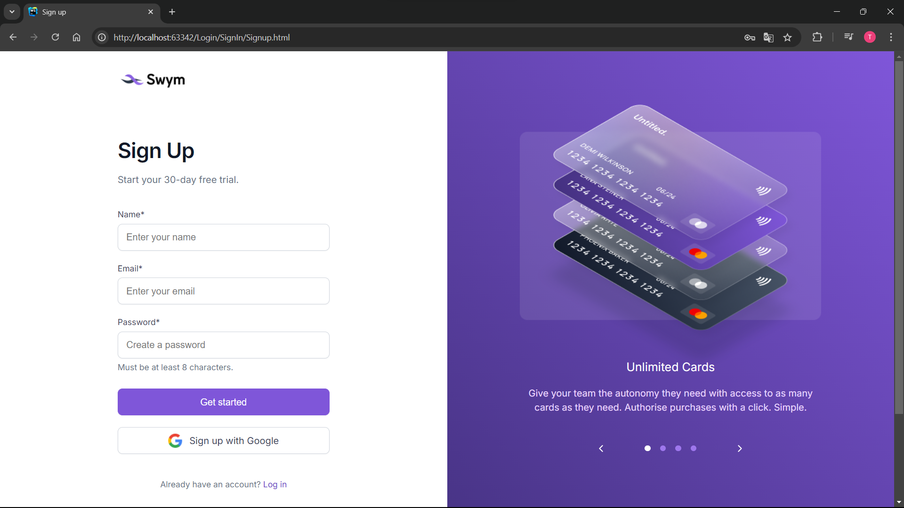

# Fullstack Project 

Dit project is volledig door mij ontwikkeld tijdens mijn stage waarbij ik zowel de front-end als de back-end heb gebouwd. Het ontwerp is geleverd via Figma door mijn werkplekcoach en ik heb dit omgezet naar een werkende applicatie met speciale aandacht voor pixel-perfecte ontwikkeling. Gebruikers kunnen inloggen en registreren en er is een methode om het wachtwoord te veranderen. 
Gebruikersgegevens worden opgeslagen in de database.

Zie Frontend: https://github.com/TalhaFerahPXL/Swym-Login-Frontend

# 💻 Technologieën

Frontend: 
* *HTML, CSS, JavaScript*

Backend:
 * *.Net Core Web Api*
 * *SQL Server Management Studio*

# 📸 Screenshots

